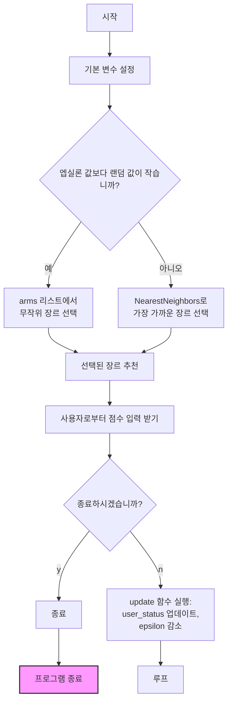

# MAB_music_recommend

UI 장르 추천 클릭하면 

```mermaid
flowchart TD
    시작 --> reset[기본 변수 설정] --> epsilon{
        엡실론 값보다 랜덤 값이 작습니까?
    }
    epsilon -->|예| explore[arms 리스트에서<br>무작위 장르 선택] --> 추천[선택된 장르 추천]
    epsilon -->|아니오| exploit[NearestNeighbors로<br>가장 가까운 장르 선택] --> 추천

    추천 --> 점수입력[사용자로부터 점수 입력 받기]
    점수입력 --> 종료확인{종료하시겠습니까?}
    
    종료확인 -->|y| 종료
    종료확인 -->|n| 업데이트[update 함수 실행:<br>user_status 업데이트,<br>epsilon 감소] --> 루프

    종료 --> 끝[프로그램 종료]

    style 끝 fill:#f9f,stroke:#333,stroke-width:2px

```