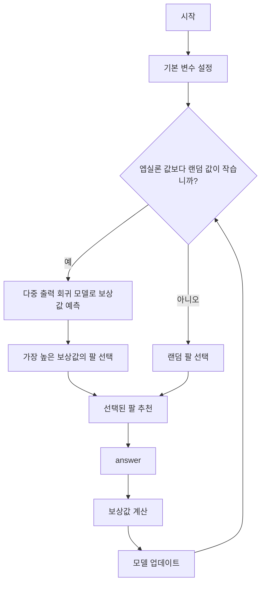

# MAB_music_recommend

title: MAB_music_recommend
emoji: 🎧
app_file: app.py
pinned: false

```mermaid
flowchart TD
    시작 --> reset[기본 변수 설정] --> epsilon{
        엡실론 값보다 랜덤 값이 작습니까?
    }
    epsilon -->|예| MultiOutputRegressor[다중 출력 회귀 모델로 보상값 예측] --> get_highest[가장 높은 보상값의 팔 선택] --> recommend[선택된 팔 추천천]
    epsilon -->|아니오| random[랜덤 팔 선택] --> recommend[선택된 팔 추천]
    recommend --> answer --> caculate[보상값 계산] --> update[모델 업데이트] --> epsilon
    
```